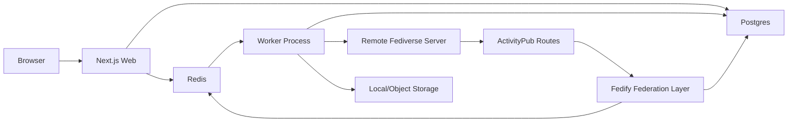

# Federated Microblog Technical Plan

Status: planning draft

Last updated: 2026-04-27

## 1. Product Direction

Zer0 is a small multi-user fediverse microblog built with Next.js. It should interoperate with Mastodon, Misskey, and other ActivityPub software while staying simple enough for a small instance operator to understand and maintain.

User-authored posts are called `zosts` in product language. In protocol and federation code, a local `zost` maps primarily to an ActivityPub `Note`, usually wrapped by a `Create` activity when published.

The first version targets a complete daily-use MVP:

- Local multi-user accounts.
- Email/password authentication with bootstrap-admin registration, then invite-only registration.
- Home timeline, compose box, post detail, profiles, notifications, remote user search, and settings.
- ActivityPub federation through Fedify.
- Media attachments with local storage first and object-storage abstraction.
- Basic administration for invites, domain/user blocking, hidden posts, and delivery failure logs.
- Quiet, tool-like UI using Base UI primitives and Kumo UI components.

## 2. Confirmed Decisions

| Area | Decision |
| --- | --- |
| App type | Small multi-user instance |
| Runtime shape | Next.js Web app plus independent Worker process |
| Database | Postgres |
| ORM | Drizzle ORM |
| Queue | BullMQ + Redis |
| Authentication | Better Auth, email/password, first user without invite, later users invite-only |
| Federation | Fedify-based ActivityPub implementation |
| Federation scope | Core ActivityPub interoperability plus media attachments |
| Visibility | Public, Unlisted, Followers-only, Direct |
| Public access | Semi-public: public profiles and public posts are viewable; timelines/search/settings require login |
| Administration | Basic management only |
| UI direction | Quiet tool-style interface |
| Product name | Zer0 |
| Post name | Zost |
| Planning document | `docs/technical-plan.md` |

## 3. Core Architecture

The app is split into two long-running processes:

- `web`: Next.js app that renders UI, serves route handlers, handles auth, exposes ActivityPub endpoints, and creates queue jobs.
- `worker`: BullMQ consumers that perform slow or retryable work: ActivityPub delivery, remote actor lookup, inbox side effects, media processing, digest jobs, and cleanup.

High-level flow:

### Key Modules

- `src/app`: Next.js App Router pages and route handlers.
- `src/features/auth`: Better Auth setup, session helpers, invite checks.
- `src/features/federation`: Fedify setup, actor dispatchers, inbox listeners, object dispatchers, delivery helpers.
- `src/features/posts`: zost creation, visibility, mentions, attachments, timelines.
- `src/features/accounts`: local users, profiles, remote actors, follow graph.
- `src/features/notifications`: local notification creation and read state.
- `src/features/admin`: invites, blocks, moderation actions, federation logs.
- `src/db`: Drizzle schema, migrations, query helpers.
- `src/queue`: BullMQ queues, job types, producers.
- `src/worker`: worker entrypoint and job processors.
- `src/storage`: media storage adapter with local and object-storage implementations.
- `src/components`: shared UI primitives and Kumo/Base UI wrappers.

Before implementing Next.js-specific code, read the relevant local Next 16 docs under `node_modules/next/dist/docs/` as required by `AGENTS.md`.

## 4. Dependencies

Expected runtime dependencies:

- `better-auth` for authentication.
- `drizzle-orm` and a Postgres driver.
- `drizzle-kit` for migrations.
- `bullmq` for queues.
- Redis client compatible with BullMQ.
- `@fedify/fedify` and, after verification, Fedify Redis/Postgres integrations where useful.
- `@base-ui/react` for accessible interaction primitives.
- Kumo UI CLI/components through `@cloudflare/kumo`.
- Media utilities as needed for metadata extraction and image transforms.

Implementation should verify current APIs through official docs before adding these packages. Fedify is documented as a TypeScript ActivityPub framework with WebFinger, ActivityPub, HTTP Signatures, Linked Data Signatures, NodeInfo, and integration support.

## 5. Data Model

This is a planning-level schema. Exact columns should be finalized while implementing migrations.

### Auth and Local Users

- `users`: local user identity, username, display name, bio, avatar, header, admin flag, disabled flag.
- `accounts`: Better Auth account records.
- `sessions`: Better Auth sessions.
- `verification_tokens`: email and auth verification tokens.
- `invites`: invite code, creator, max uses, used count, expiry, disabled flag.

### Federation Identity

- `actors`: one row per local or remote actor.
  - `id`, `type`, `handle`, `domain`, `uri`, `inbox_url`, `shared_inbox_url`, `outbox_url`, `followers_url`, `following_url`.
  - `preferred_username`, `name`, `summary`, `avatar_url`, `header_url`.
  - `public_key_pem`, `private_key_ref` for local actors only.
  - `raw_json`, `last_fetched_at`, `blocked_at`.
- `actor_keys`: local actor signing keys, key id, public key, encrypted private key, algorithm, created/rotated timestamps.
- `remote_fetches`: cache and diagnostics for WebFinger/object fetches.

### Social Graph

- `follows`: local and remote follow state.
  - `follower_actor_id`, `followee_actor_id`, `state` (`pending`, `accepted`, `rejected`, `cancelled`), `activity_uri`.
- `blocks`: local actor blocks and admin-level domain/actor blocks.
- `mutes`: local user mutes for UI filtering.

### Zosts, Posts, and Objects

- `posts`: normalized local and remote notes. Local user-authored posts are called zosts in the UI and product copy.
  - `uri`, `url`, `author_actor_id`, `content_html`, `content_text`, `summary`, `language`.
  - `visibility` (`public`, `unlisted`, `followers`, `direct`).
  - `reply_to_post_id`, `reply_to_uri`, `conversation_id`.
  - `sensitive`, `published_at`, `edited_at`, `deleted_at`, `hidden_at`.
  - `raw_json` for remote ActivityPub object retention.
- `post_recipients`: explicit recipients for Direct and audience calculation.
- `post_mentions`: actor mentions parsed from local/remote content.
- `post_tags`: hashtags and normalized search tokens.
- `post_stats`: cached reply, boost, like counters.
- `activities`: ActivityPub activities received or generated.
  - `uri`, `type`, `actor_id`, `object_uri`, `target_uri`, `raw_json`, `created_at`.

### Reactions and Timelines

- `likes`: local/remote likes.
- `announces`: boosts/reposts.
- `bookmarks`: local-only saved posts.
- `timeline_items`: precomputed home timeline rows for local users.
- `notifications`: follow, mention, reply, like, announce, direct post, delivery/admin notices.

### Media

- `media_assets`: uploaded or remote media metadata.
  - `owner_user_id`, `storage_key`, `remote_url`, `mime_type`, `byte_size`, `width`, `height`, `alt_text`, `blurhash`, `sensitive`.
- `post_media`: ordered relation between posts and media.
- `media_variants`: thumbnails, previews, transformed versions.

### Administration and Operations

- `domain_blocks`: blocked or silenced domains.
- `moderation_actions`: admin actions and reason.
- `delivery_jobs`: outgoing delivery attempts and status.
- `inbox_events`: incoming activity processing status.
- `audit_logs`: security-sensitive actions, admin changes, invite use.

## 6. ActivityPub and Fedify Plan

Fedify should own the protocol-heavy pieces:

- WebFinger resource discovery.
- Actor dispatching for local users.
- Inbox listeners for incoming activities.
- Object dispatching for local posts and media-bearing objects.
- Sending activities with proper signing.
- NodeInfo endpoint, if practical in phase one.
- CLI/debugger-assisted federation testing.

Local application code should own product semantics:

- Authorization and visibility checks.
- Mapping Fedify vocabulary objects to database records.
- Timeline fanout.
- Notification creation.
- Moderation policy.
- Media storage and access checks.
- Admin diagnostics.

### Required Endpoints

Expected public endpoints:

- `/.well-known/webfinger`
- `/users/[username]`
- `/users/[username]/inbox`
- `/users/[username]/outbox`
- `/users/[username]/followers`
- `/users/[username]/following`
- `/inbox` for shared inbox
- `/objects/[id]` or `/posts/[id]` for ActivityPub object lookup
- `/nodeinfo/2.1` and `/.well-known/nodeinfo` if supported in the first implementation pass

HTML pages may share URL shapes with ActivityPub objects through content negotiation where practical. If Next route handlers make that awkward, use explicit ActivityPub object routes and canonical `url` links back to HTML pages.

### Supported Activities

Phase one should support:

- `Follow`, `Accept`, `Reject`, `Undo Follow`
- `Create Note`
- `Delete Note`
- `Like`, `Undo Like`
- `Announce`, `Undo Announce`
- `Update Person`
- `Create` with media attachments

Defer until after MVP:

- post editing federation beyond storing `Update`
- polls
- quote posts
- lists
- relays
- moderation reports federation

### Visibility Rules

`public`:

- Addressed to ActivityStreams Public.
- Appears on public profile and public post pages.
- Eligible for remote public timelines where accepted by other servers.

`unlisted`:

- Addressed publicly but not shown in local public profile/timeline listings by default.
- Direct URL remains accessible.

`followers`:

- Delivered to accepted followers.
- Not publicly rendered.
- Requires local viewer to be author or accepted follower.

`direct`:

- Delivered only to explicit local/remote recipients.
- Not indexed, not visible in public profile, not included in public collections.
- UI must label it clearly as limited-recipient federation, not end-to-end encrypted private messaging.
- Media access must use the same recipient policy as the post.

## 7. Queue and Worker Plan

Use BullMQ queues with typed job payloads.

Recommended queues:

- `federation:deliver`: deliver one activity to one inbox or shared inbox.
- `federation:fanout`: expand recipients and enqueue delivery jobs.
- `federation:inbox`: process accepted inbox activities after signature and basic validation.
- `federation:fetch`: WebFinger, actor fetch, object fetch, refresh stale remote actor.
- `media:process`: inspect upload, extract dimensions, generate thumbnail/preview.
- `timelines:fanout`: write timeline items for followers and local viewers.
- `notifications:create`: generate notifications from social events.
- `maintenance:cleanup`: expire tokens, prune logs, retry stuck jobs.

Delivery jobs should record:

- target inbox URL
- activity URI/type
- attempt count
- response status/body excerpt
- next retry time
- final failure reason

Use exponential backoff with a dead-letter state. Admin UI should show failed deliveries and allow manual retry.

## 8. Storage Plan

Start with local filesystem storage for development:

- Original uploads under a configured data directory.
- Generated variants in adjacent keys.
- Public access through signed or policy-checked routes, not direct filesystem paths.

Provide an adapter interface:

- `putObject`
- `getObject`
- `deleteObject`
- `createReadUrl`
- `createWriteUrl` if direct uploads are introduced later

Add S3-compatible object storage after local flow is stable.

Media validation:

- Allow image uploads in MVP.
- Enforce max file size, MIME sniffing, and extension normalization.
- Store alt text.
- Support sensitive media flag.
- Strip unsafe metadata where practical.

## 9. Authentication and Authorization

Use Better Auth for:

- Email/password login.
- Session management.
- Password reset and verification flows if available and compatible.

Custom app logic:

- Invite code required during registration after the first local user exists.
- First registered local user does not need an invite and becomes admin.
- Username reservation and validation.
- Admin can create, disable, expire, and inspect invites.
- Disabled users cannot log in, post, or deliver new activities.

Authorization rules:

- All write actions require a valid local session.
- Local API routes must check actor ownership, not only user session.
- Admin routes require admin flag and should write audit logs.
- ActivityPub inbox routes authenticate through HTTP signatures/Fedify mechanisms, then still apply domain and actor block policy.

## 10. Frontend Plan

The UI should be compact, readable, and efficient for repeated use. Avoid marketing-style layouts and oversized hero sections. The first screen after login should be the usable home timeline.

Use:

- Base UI for accessible primitives: Dialog, Popover, Menu, Tabs, Tooltip, Select, Checkbox, Switch, Field, Form, Toast, Scroll Area.
- Kumo UI for visual components and blocks where they fit: buttons, inputs, page headers, empty states, panels, badges, list items.
- Tailwind 4 for layout and product-specific styling.

### Main Screens

- `/login`: login form.
- `/register`: first-user bootstrap registration, then invite-only registration.
- `/`: authenticated home timeline.
- `/compose`: optional focused compose route; main compose should also exist inline.
- `/@username`: local profile page.
- `/@username/[postId]`: post detail thread.
- `/notifications`: notifications with tabs for all, mentions, follows.
- `/search`: remote actor/post lookup and local search.
- `/settings/profile`: profile, avatar, header, bio.
- `/settings/account`: password/session/account controls.
- `/settings/federation`: privacy defaults, discoverability, import/export later.
- `/admin`: basic admin dashboard.
- `/admin/invites`
- `/admin/blocks`
- `/admin/federation`: inbox/delivery logs.

### Core Components

- App shell with left navigation and right utility rail on desktop.
- Compact mobile bottom navigation.
- Timeline list with stable row sizing and clear interaction buttons.
- Compose box with visibility selector, media picker, content warning, character count, and recipient chips for Direct.
- Post card with reply, boost, like, bookmark, menu, and visibility indicator.
- Profile header with follow/unfollow controls.
- Remote actor search result row.
- Notification row grouped by type.
- Admin tables with filters and retry actions.

## 11. API and Server Actions

Prefer server-side mutations for authenticated local app behavior where they fit Next 16 guidance. Use route handlers where external systems or ActivityPub endpoints need direct HTTP semantics.

Internal API examples:

- `createPost`
- `deletePost`
- `likePost`
- `announcePost`
- `replyToPost`
- `followActor`
- `unfollowActor`
- `searchRemoteActor`
- `uploadMedia`
- `updateProfile`
- `createInvite`
- `blockDomain`
- `retryDelivery`

All mutation paths should:

- validate input with a shared schema
- check session and ownership
- write database transaction
- enqueue relevant queue jobs after commit
- return compact UI-friendly result

## 12. Moderation and Administration

MVP admin features:

- Invite creation and revocation.
- Disable local users.
- Block remote actor.
- Block remote domain.
- Hide local/remote post from local UI.
- Inspect inbox processing failures.
- Inspect outgoing delivery failures.
- Retry failed delivery.

Policy enforcement:

- Domain block stops inbox acceptance, remote fetch, follow creation, and outgoing delivery where appropriate.
- Actor block hides content locally and prevents future interactions.
- Hidden posts remain in the database for federation consistency but are removed from local timelines.

## 13. Observability

Minimum observability:

- Structured application logs.
- Queue job logs and failure reasons.
- Admin-visible federation diagnostics.
- Health endpoint checking Postgres and Redis.
- Seed/dev command for local test users.

Later:

- OpenTelemetry traces.
- Metrics dashboard.
- Federation compatibility test matrix.

## 14. Security Notes

- Store local actor private keys encrypted or behind a clear key-management abstraction.
- Validate and sanitize all remote HTML before rendering.
- Never trust remote `content`, `summary`, `name`, `url`, or media metadata.
- Enforce SSRF protections for remote fetches and media proxying.
- Cap inbox payload size.
- Rate-limit login, registration, inbox, remote search, and media upload.
- Direct posts are not encrypted. The UI should not market them as secure private messages.
- Media routes must check post visibility before serving protected media.
- Audit admin actions and invite usage.

## 15. Testing Strategy

Unit tests:

- Visibility checks.
- Recipient calculation.
- HTML sanitization.
- Activity mapping.
- Queue payload schemas.
- Domain/actor block policy.

Integration tests:

- Auth registration without invite for first user.
- Auth registration with invite for later users.
- Create post and timeline insertion.
- Follow accept flow.
- Inbox `Create Note` handling.
- Outgoing delivery job creation.
- Media upload and post attachment.

Federation tests:

- Fedify CLI lookup for local actors and objects.
- Mastodon remote follow smoke test.
- Misskey remote follow smoke test.
- Delivery retry and failure logging.

UI checks:

- Desktop and mobile timeline layout.
- Keyboard navigation for compose, menus, dialogs, and visibility selector.
- Auth and admin forms.
- Text overflow in timeline and profile surfaces.

## 16. Implementation Milestones

### Milestone 0: Project Foundation

- Read relevant Next 16 local docs.
- Install and configure dependencies.
- Set up Drizzle schema and migrations.
- Add environment validation.
- Add app shell and UI component foundation.
- Add local dev services documentation for Postgres and Redis.

### Milestone 1: Auth and Local Accounts

- Configure Better Auth.
- Add first-user bootstrap registration.
- Add invite-only registration for later users.
- Implement login/register/settings UI.
- Add local user profile model.

### Milestone 2: Posting and Local Timelines

- Create posts with visibility.
- Add compose box.
- Add home timeline.
- Add profile and post detail pages.
- Add replies, likes, boosts, and bookmarks locally.

### Milestone 3: Media

- Add local storage adapter.
- Implement upload and processing queue.
- Add attachments to compose and post rendering.
- Add protected media serving based on visibility.

### Milestone 4: Fedify Integration

- Configure Fedify federation layer.
- Implement WebFinger and actor dispatch.
- Implement inbox listeners.
- Implement object dispatch for posts.
- Implement outgoing follow and post delivery.
- Add delivery logs.

### Milestone 5: Federation Compatibility

- Test local actor lookup with Fedify CLI.
- Test remote follow with Mastodon and Misskey.
- Test remote create/reply/like/announce flows.
- Fix content mapping and compatibility issues.
- Add NodeInfo if not already done.

### Milestone 6: Admin and Hardening

- Add admin dashboard.
- Add invites, domain blocks, actor blocks, hidden posts.
- Add delivery retry UI.
- Add rate limiting and payload caps.
- Add backup/export notes.

## 17. Open Questions

- Instance domain and canonical URL strategy.
- Email provider for verification/password reset.
- Whether registration requires email verification before first login.
- Maximum post length.
- Initial media limits and supported MIME types.
- Object storage provider for production.
- Whether to support custom emoji in MVP.
- Whether local public timeline exists or only home/profile/search.
- Whether to expose RSS/Atom feeds for public profiles.

## 18. Reference Links

- Fedify official site: https://fedify.dev/
- Fedify microblog tutorial: https://fedify.dev/tutorial/microblog
- Fedify sending activities manual: https://fedify.dev/manual/send
- Base UI docs index is referenced locally through `/Users/jake/.codex/skills/base-ui/references/llms.txt`.
- Kumo UI usage is referenced locally through `/Users/jake/.codex/skills/kumo-ui/references/cli.md` and `/Users/jake/.codex/skills/kumo-ui/references/registry.md`.
